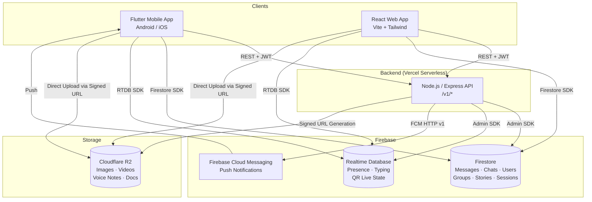
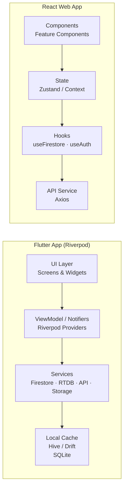
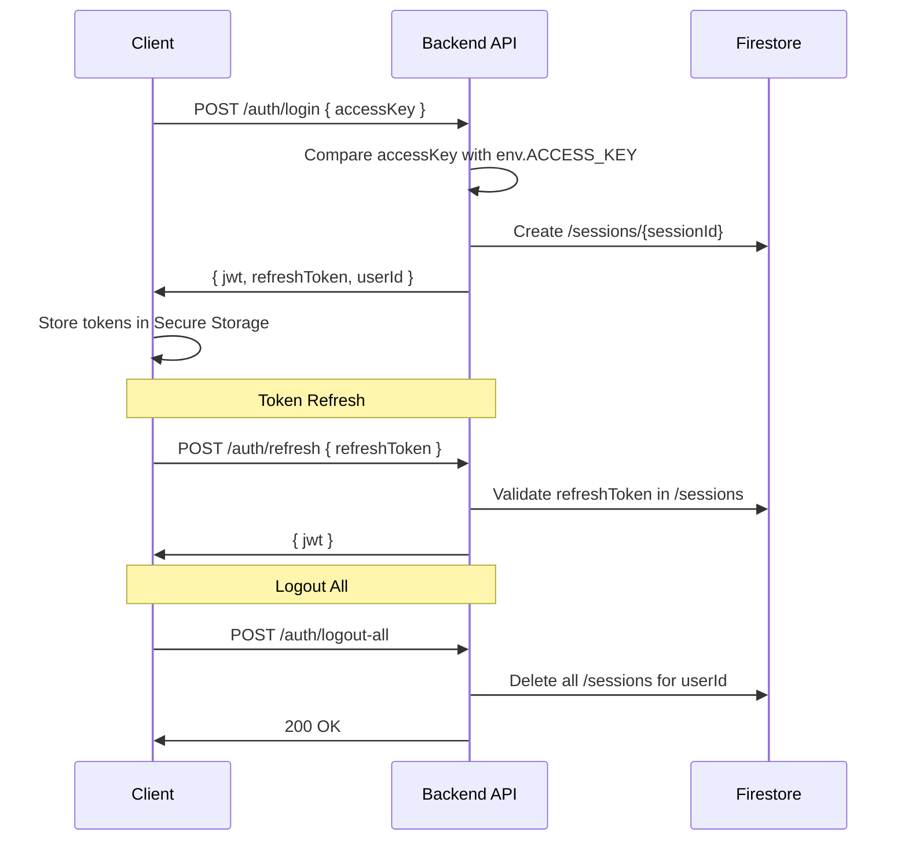
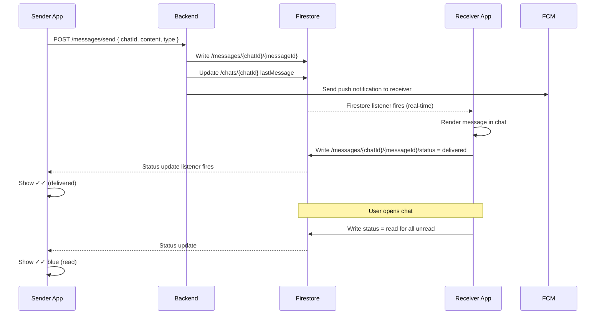

## 9. System Architecture

### 9.1 Overall System Architecture



### 9.2 Client Architecture



### 9.3 Backend Architecture

```mermaid
graph TD
    subgraph Vercel ["Vercel Serverless Functions"]
        ROUTER[Express Router]
        AUTH_MW[Auth Middleware\nJWT Verify]
        VAL[Validation Layer\nZod Schemas]

        subgraph Routes
            AR[/auth/*]
            MR[/messages/*]
            CR[/chats/*]
            GR[/groups/*]
            SR[/stories/*]
            PR[/profile/*]
            STR[/storage/*]
            NR[/notifications/*]
            ADM[/admin/*]
        end

        subgraph Services
            AUTHS[AuthService]
            MSGS[MessageService]
            STRS[StorageService]
            NTFS[NotificationService]
            QRS[QRService]
        end
    end

    ROUTER --> AUTH_MW --> VAL --> Routes
    Routes --> Services
```

### 9.4 Authentication Flow



### 9.5 Chat Synchronization Flow



---

## 10. Firestore Design

### 10.1 Design Principles

- All collections use auto-generated or client-generated UUID document IDs
- Timestamps use Firestore `Timestamp` type
- Booleans never stored as strings
- Arrays used for small, bounded lists (member IDs, reaction types)
- Sub-collections used for messages and read receipts to avoid document size limits
- Composite indexes defined for all multi-field queries

### 10.2 Collection: `users`

**Path:** `/users/{userId}`

| Field | Type | Description |
|---|---|---|
| `userId` | `string` | Same as document ID; Firebase UID |
| `name` | `string` | Display name |
| `username` | `string` | Unique lowercase username (e.g., `@alex`) |
| `about` | `string` | Bio / status text |
| `profilePhotoUrl` | `string` | R2 CDN URL for profile photo |
| `fcmToken` | `string` | Latest FCM push token |
| `fcmTokenUpdatedAt` | `Timestamp` | When FCM token was last updated |
| `blockedUserIds` | `array<string>` | List of user IDs this user has blocked |
| `createdAt` | `Timestamp` | Account creation time |
| `updatedAt` | `Timestamp` | Last profile update time |

**Sub-collection:** `/users/{userId}/privacySettings`

**Path:** `/users/{userId}/privacySettings/config` (single document)

| Field | Type | Description |
|---|---|---|
| `showLastSeen` | `boolean` | Whether last seen is visible to others |
| `showOnline` | `boolean` | Whether online status is visible to others |
| `readReceipts` | `boolean` | Whether read receipts are sent/received |
| `profilePhotoPrivacy` | `string` | `"all"` or `"nobody"` |
| `storyPrivacy` | `string` | `"all"` or `"custom"` |
| `storyPrivacyList` | `array<string>` | User IDs who can see stories (if custom) |

**Sub-collection:** `/users/{userId}/preferences`

**Path:** `/users/{userId}/preferences/app` (single document)

| Field | Type | Description |
|---|---|---|
| `theme` | `string` | `"light"` or `"dark"` |
| `notificationSounds` | `boolean` | Global notification sound toggle |
| `updatedAt` | `Timestamp` | Last updated |

**Indexes:**
- `username ASC` (for username lookup)

---

### 10.3 Collection: `chats`

**Path:** `/chats/{chatId}`

| Field | Type | Description |
|---|---|---|
| `chatId` | `string` | Document ID |
| `type` | `string` | `"one_to_one"` or `"group"` |
| `participantIds` | `array<string>` | User IDs in this chat (for one-to-one: 2 users) |
| `lastMessage` | `map` | Snapshot of last message (see below) |
| `lastMessageAt` | `Timestamp` | Timestamp of last message (for ordering) |
| `createdAt` | `Timestamp` | Chat creation time |
| `createdBy` | `string` | userId who created the chat |

**`lastMessage` map fields:**

| Field | Type | Description |
|---|---|---|
| `messageId` | `string` | Reference to message |
| `senderId` | `string` | Sender userId |
| `content` | `string` | Text content or media type label |
| `type` | `string` | `"text"`, `"image"`, `"video"`, etc. |
| `timestamp` | `Timestamp` | Message timestamp |
| `status` | `string` | `"sent"`, `"delivered"`, `"read"` |

**Sub-collection:** `/chats/{chatId}/settings/{userId}`

Per-user chat settings (one document per participant):

| Field | Type | Description |
|---|---|---|
| `userId` | `string` | Owner of these settings |
| `isPinned` | `boolean` | Whether this chat is pinned |
| `pinnedAt` | `Timestamp` | When pinned (for ordering up to 3) |
| `isArchived` | `boolean` | Whether this chat is archived |
| `isMuted` | `boolean` | Whether notifications are muted |
| `muteUntil` | `Timestamp` | Mute expiry (null = forever) |
| `wallpaper` | `string` | R2 URL for custom wallpaper |
| `unreadCount` | `number` | Unread message count |
| `lastReadMessageId` | `string` | Last message read by this user |
| `updatedAt` | `Timestamp` | Last settings update |

**Indexes:**
- `participantIds ARRAY_CONTAINS, lastMessageAt DESC` (fetch chats for a user, ordered)
- `participantIds ARRAY_CONTAINS, isArchived, lastMessageAt DESC` (archived chats)

---

### 10.4 Collection: `messages`

**Path:** `/messages/{chatId}/chatMessages/{messageId}`

(Sub-collection of chat; not at root level for security and scalability)

| Field | Type | Description |
|---|---|---|
| `messageId` | `string` | Client-generated UUID |
| `chatId` | `string` | Parent chat ID |
| `senderId` | `string` | Sender userId |
| `type` | `string` | `"text"`, `"image"`, `"video"`, `"audio"`, `"voice_note"`, `"document"`, `"gif"`, `"sticker"`, `"deleted"` |
| `content` | `string` | Text content (if type=text) |
| `mediaUrl` | `string` | R2 CDN URL (if media message) |
| `mediaThumbnailUrl` | `string` | R2 thumbnail URL (for video/image) |
| `mediaSize` | `number` | File size in bytes |
| `mediaName` | `string` | Original file name (for documents) |
| `mediaDuration` | `number` | Duration in seconds (for audio/video) |
| `replyTo` | `map` | Quoted message snapshot (see below) |
| `forwardedFrom` | `string` | Original chatId if forwarded |
| `reactions` | `map<string, array<string>>` | emoji → [userId, ...] |
| `isEdited` | `boolean` | Whether message was edited |
| `editedAt` | `Timestamp` | Last edit timestamp |
| `isDeletedForEveryone` | `boolean` | Whether deleted for everyone |
| `isPinned` | `boolean` | Whether pinned in chat |
| `pinnedAt` | `Timestamp` | When pinned |
| `pinnedBy` | `string` | userId who pinned |
| `status` | `string` | `"sending"`, `"sent"`, `"delivered"`, `"read"` |
| `sentAt` | `Timestamp` | Server timestamp when sent |
| `deliveredAt` | `Timestamp` | When delivered to all recipients |
| `readAt` | `Timestamp` | When read by all recipients |
| `mentions` | `array<string>` | User IDs @mentioned in this message |

**`replyTo` map fields:**

| Field | Type | Description |
|---|---|---|
| `messageId` | `string` | Original message ID |
| `senderId` | `string` | Original sender |
| `content` | `string` | Snippet of original content |
| `type` | `string` | Type of original message |
| `mediaUrl` | `string` | Thumbnail if original was media |

**Sub-collection:** `/messages/{chatId}/chatMessages/{messageId}/readReceipts/{userId}`

For group chats, per-user read receipts:

| Field | Type | Description |
|---|---|---|
| `userId` | `string` | Reader userId |
| `deliveredAt` | `Timestamp` | When delivered to this user |
| `readAt` | `Timestamp` | When read by this user |

**Indexes:**
- `sentAt ASC` (paginate messages, oldest first)
- `isPinned, sentAt DESC` (fetch pinned messages)
- `senderId, sentAt DESC` (messages by sender within a chat)

---

### 10.5 Collection: `starredMessages`

**Path:** `/starredMessages/{userId}/items/{messageId}`

| Field | Type | Description |
|---|---|---|
| `messageId` | `string` | Reference to original message |
| `chatId` | `string` | Chat containing the message |
| `senderId` | `string` | Original sender |
| `content` | `string` | Snapshot of message content |
| `type` | `string` | Message type |
| `mediaUrl` | `string` | Media URL if applicable |
| `starredAt` | `Timestamp` | When starred |

---

### 10.6 Collection: `groups`

**Path:** `/groups/{groupId}`

Note: `groupId` is the same as the corresponding `chatId` in the `chats` collection.

| Field | Type | Description |
|---|---|---|
| `groupId` | `string` | Document ID = chatId |
| `name` | `string` | Group display name |
| `description` | `string` | Group description |
| `photoUrl` | `string` | R2 CDN URL for group photo |
| `createdBy` | `string` | userId of creator |
| `createdAt` | `Timestamp` | Creation time |
| `updatedAt` | `Timestamp` | Last update |
| `inviteCode` | `string` | Shareable invite code (UUID) |
| `inviteCodeEnabled` | `boolean` | Whether invite link is active |

**Sub-collection:** `/groups/{groupId}/members/{userId}`

| Field | Type | Description |
|---|---|---|
| `userId` | `string` | Member userId |
| `role` | `string` | `"admin"` or `"member"` |
| `joinedAt` | `Timestamp` | When they joined |
| `addedBy` | `string` | userId of who added them |

**Indexes:**
- `members/{userId}` (check membership)
- `role = "admin"` (list admins)

---

### 10.7 Collection: `stories`

**Path:** `/stories/{storyId}`

| Field | Type | Description |
|---|---|---|
| `storyId` | `string` | Document ID |
| `userId` | `string` | Author userId |
| `type` | `string` | `"text"`, `"image"`, `"video"` |
| `content` | `string` | Text content (if type=text) |
| `mediaUrl` | `string` | R2 CDN URL (if media) |
| `mediaThumbnailUrl` | `string` | Thumbnail URL for video stories |
| `backgroundColor` | `string` | Hex color for text stories |
| `textColor` | `string` | Hex text color for text stories |
| `caption` | `string` | Optional caption |
| `privacyMode` | `string` | `"all"` or `"custom"` |
| `privacyList` | `array<string>` | User IDs who can see this story |
| `createdAt` | `Timestamp` | Posted at |
| `expiresAt` | `Timestamp` | Always createdAt + 24 hours |
| `isDeleted` | `boolean` | Soft delete flag |
| `viewCount` | `number` | Cached view count |

**Sub-collection:** `/stories/{storyId}/views/{userId}`

| Field | Type | Description |
|---|---|---|
| `userId` | `string` | Viewer userId |
| `viewedAt` | `Timestamp` | When viewed |

**Indexes:**
- `userId, expiresAt DESC` (fetch user's active stories)
- `expiresAt ASC` (cleanup job: find expired stories)

---

### 10.8 Collection: `contacts`

**Path:** `/contacts/{userId}/userContacts/{contactId}`

| Field | Type | Description |
|---|---|---|
| `contactId` | `string` | The contact's userId |
| `name` | `string` | Display name set by this user (override) |
| `addedAt` | `Timestamp` | When added |

---

### 10.9 Collection: `sessions`

**Path:** `/sessions/{sessionId}`

| Field | Type | Description |
|---|---|---|
| `sessionId` | `string` | UUID |
| `userId` | `string` | Owner |
| `refreshToken` | `string` | Hashed refresh token |
| `deviceName` | `string` | e.g., "Pixel 8" or "Chrome on Mac" |
| `platform` | `string` | `"android"`, `"ios"`, `"web"` |
| `ipAddress` | `string` | Last known IP |
| `createdAt` | `Timestamp` | Session start |
| `lastActiveAt` | `Timestamp` | Last activity |
| `expiresAt` | `Timestamp` | Refresh token expiry (30 days) |
| `isActive` | `boolean` | Whether this session is valid |

**Indexes:**
- `userId, isActive` (list active sessions for a user)
- `expiresAt ASC` (cleanup expired sessions)

---

### 10.10 Collection: `qrSessions`

**Path:** `/qrSessions/{qrSessionId}`

| Field | Type | Description |
|---|---|---|
| `qrSessionId` | `string` | UUID |
| `status` | `string` | `"pending"`, `"scanned"`, `"confirmed"`, `"denied"`, `"expired"` |
| `createdAt` | `Timestamp` | Created at |
| `expiresAt` | `Timestamp` | createdAt + 60 seconds |
| `scannedAt` | `Timestamp` | When mobile scanned it |
| `confirmedAt` | `Timestamp` | When mobile confirmed |
| `jwt` | `string` | Issued JWT (populated on confirm; web reads this) |
| `refreshToken` | `string` | Issued refresh token |
| `sessionId` | `string` | Created session ID |
| `ipAddress` | `string` | Web client IP |

**Indexes:**
- `expiresAt ASC` (cleanup expired QR sessions)
- `status` (find pending/confirmed sessions)

---

### 10.11 Collection: `notifications`

**Path:** `/notifications/{userId}/items/{notificationId}`

| Field | Type | Description |
|---|---|---|
| `notificationId` | `string` | UUID |
| `type` | `string` | `"message"`, `"group_message"`, `"mention"`, `"story_reply"`, `"story_view"` |
| `senderId` | `string` | Sender userId |
| `chatId` | `string` | Relevant chat |
| `messageId` | `string` | Relevant message |
| `preview` | `string` | Short preview text |
| `isRead` | `boolean` | Whether notification was read |
| `createdAt` | `Timestamp` | When created |

---

## 11. Realtime Database Design

### 11.1 Why Realtime Database (Not Firestore)?

Firestore is optimized for persistent, structured data with complex queries. The Firebase Realtime Database (RTDB) is used for ephemeral, high-frequency, low-latency state that:

1. Changes many times per second (typing indicators)
2. Must be automatically cleaned up on disconnect (`onDisconnect`)
3. Requires sub-second propagation to all listeners
4. Has no need for rich querying or indexing

Storing presence in Firestore would result in excessive write costs and document update conflicts. RTDB's `onDisconnect()` handler is the definitive solution for presence management.

### 11.2 RTDB Node: `/presence/{userId}`

**Why RTDB:** `onDisconnect()` is essential for accurate online/offline detection.

```json
{
  "presence": {
    "{userId}": {
      "state": "online",
      "lastSeen": 1720000000000,
      "platform": "android"
    }
  }
}
```

| Field | Type | Description |
|---|---|---|
| `state` | `string` | `"online"` or `"offline"` |
| `lastSeen` | `number` | Unix timestamp ms; updated on disconnect |
| `platform` | `string` | `"android"`, `"ios"`, `"web"` |

**Write rules:**
- Client writes `state: "online"` on app foreground
- Client sets `onDisconnect` to write `state: "offline"`, `lastSeen: serverTimestamp`
- Client writes `state: "offline"` on explicit background/close

**Read rules:**
- Any authenticated user can read any user's presence
- Presence is filtered client-side based on `privacySettings.showOnline`

---

### 11.3 RTDB Node: `/typing/{chatId}/{userId}`

**Why RTDB:** Typing state changes multiple times per second; it must vanish instantly when user stops; it is never persisted.

```json
{
  "typing": {
    "{chatId}": {
      "{userId}": {
        "isTyping": true,
        "startedAt": 1720000000000
      }
    }
  }
}
```

| Field | Type | Description |
|---|---|---|
| `isTyping` | `boolean` | Always `true` when node exists |
| `startedAt` | `number` | Unix timestamp ms |

**Write rules:**
- On input change: write `isTyping: true`
- On send or 2s inactivity: delete the node
- `onDisconnect`: delete the node

---

### 11.4 RTDB Node: `/recordingAudio/{chatId}/{userId}`

**Why RTDB:** Same as typing — ephemeral, high-frequency, needs auto-cleanup.

```json
{
  "recordingAudio": {
    "{chatId}": {
      "{userId}": {
        "isRecording": true,
        "startedAt": 1720000000000
      }
    }
  }
}
```

---

### 11.5 RTDB Node: `/qrLive/{qrSessionId}`

**Why RTDB:** QR login status must propagate from mobile to web browser in < 1 second. Firestore has ~500ms latency; RTDB is < 100ms. The web app listens to this node for instant login confirmation.

```json
{
  "qrLive": {
    "{qrSessionId}": {
      "status": "scanned",
      "updatedAt": 1720000000000
    }
  }
}
```

| Field | Type | Description |
|---|---|---|
| `status` | `string` | `"pending"`, `"scanned"`, `"confirmed"`, `"denied"`, `"expired"` |
| `updatedAt` | `number` | Unix timestamp ms |

**Write rules:**
- Backend writes on each status change
- Node auto-expires via RTDB TTL or backend cleanup after 120 seconds

---

### 11.6 RTDB Node: `/activeConnections/{userId}`

**Why RTDB:** Track concurrent active connections across devices; used to determine if any device is online.

```json
{
  "activeConnections": {
    "{userId}": {
      "{connectionId}": {
        "platform": "web",
        "connectedAt": 1720000000000
      }
    }
  }
}
```

Each connection registers itself on connect and uses `onDisconnect` to remove itself. If the user has zero child nodes, they are offline.

---

### 11.7 RTDB Security Rules

```json
{
  "rules": {
    "presence": {
      "$userId": {
        ".read": "auth != null",
        ".write": "auth != null && auth.uid === $userId"
      }
    },
    "typing": {
      "$chatId": {
        ".read": "auth != null",
        "$userId": {
          ".write": "auth != null && auth.uid === $userId"
        }
      }
    },
    "recordingAudio": {
      "$chatId": {
        ".read": "auth != null",
        "$userId": {
          ".write": "auth != null && auth.uid === $userId"
        }
      }
    },
    "qrLive": {
      "$qrSessionId": {
        ".read": "auth != null",
        ".write": "auth.token.isAdmin === true"
      }
    },
    "activeConnections": {
      "$userId": {
        ".read": "auth != null",
        ".write": "auth != null && auth.uid === $userId"
      }
    }
  }
}
```

Note: `qrLive` is written only by the backend using the Admin SDK (which bypasses rules), and read by any authenticated client. The `.write` rule for `qrLive` uses a custom claim to prevent client writes.

---