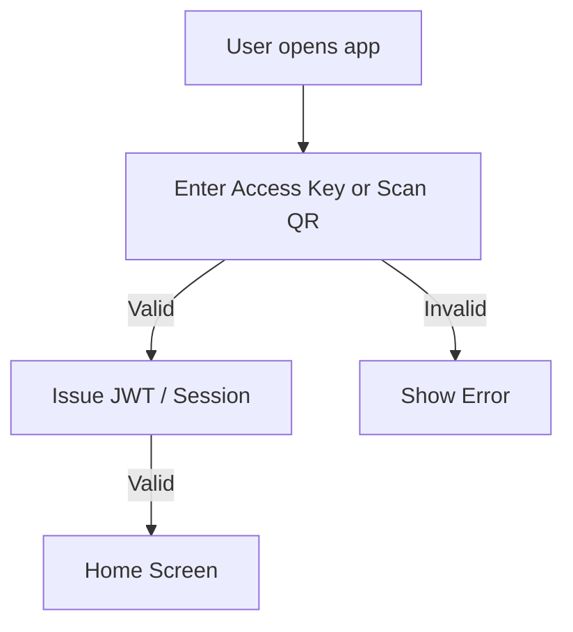
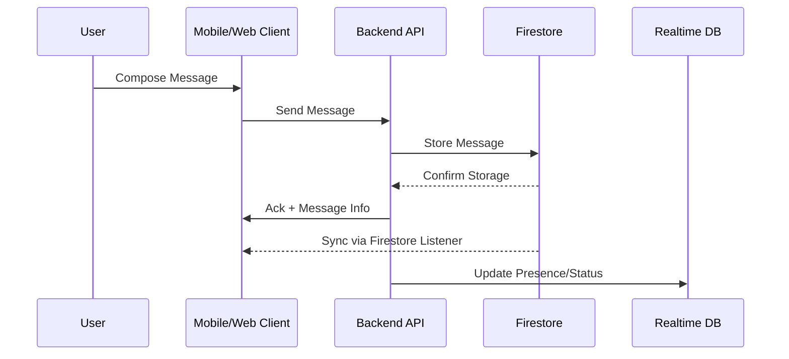
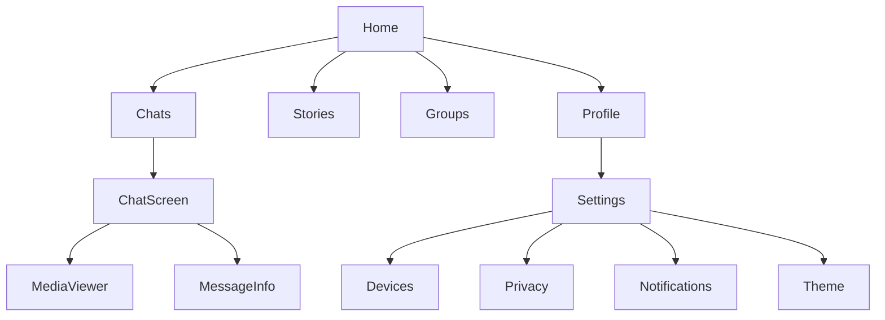
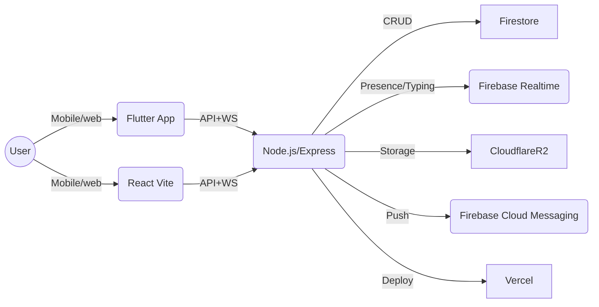
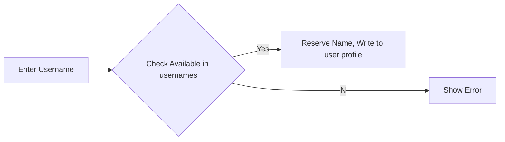

# WhatsApp-Clone-PRD

---

## 1. Executive Summary

This document details the requirements for building a modern, WhatsApp-inspired messaging platform for personal use, available on Flutter (Android-first) and React web clients. The backend is built on Node.js/Express, with Firebase Firestore/Realtime Database and Cloudflare R2 storage, all deployed via Vercel and Cloudflare. The application aims to deliver familiarity in messaging workflows, performance, privacy, and cross-device convenience, all with an original identity and robust architecture for future extensibility.

---

## 2. Product Vision

Enable seamless, secure, high-performance modern messaging, focusing on simplicity, real-time interaction, and a universally recognizable experience. Users can expect fast onboarding, intuitive navigation, instant media sharing, reliable presence/push notifications, robust privacy, and device/session management in both web and mobile environments.

---

## 3. Goals

### Business Goals

- Achieve feature/user interaction parity with leading messengers (e.g., WhatsApp) within 3 months of launch.
- Reach a daily active usage rate of >70% of registered users within the first quarter.
- Ensure 99.99% uptime and message delivery confirmation within 3 seconds.
- Maintain zero-tolerance policy for security/privacy breaches.

### User Goals

- Send messages/media instantly and reliably to individuals and groups.
- Access conversations and media seamlessly across all devices.
- Control privacy, sessions, notifications, and account data easily.
- Search and find any conversation, user, or media quickly.
- Effortlessly manage presence, visibility, and device sessions.

### Non-Goals

- No integration of phone/OTP/email verification or contacts syncing.
- Full end-to-end encryption, voice/video calling are out of Phase 1 scope.
- Enterprise or third-party integrations (Slack, Zoom, etc.) not included.

---

## 4. Non Goals

- Public APIs for third-party access will not be exposed in Phase 1.
- Monetization/ad features are not targeted for version 1.
- No multi-language or localization in the initial launch.

---

## 5. User Personas

- **Everyday Individual**: Wants a reliable, private chat platform for friends/family.
- **Power User**: Needs features like pinned/starred messages, device management, group control.
- **New User**: Values easy onboarding, username setup, and intuitive navigation.
- **Cross-Device User**: Demands seamless switching between mobile and web sessions.
- **Privacy-Conscious User**: Expects granular controls over presence, read receipts, and session history.

---

## 6. Functional Requirements

### Authentication & Sessions

- Access Key login (no phone/email).
- JWT/refresh token flows.
- QR login for web sessions, session expiry, device approval/revocation.
- Device/session management panel.

### Messaging

- 1:1 and group chats.
- Send/read status, typing indicators.
- Send: text, images, videos, voice notes, files, audio, stickers, GIFs, emojis.
- Replies, forwards, edit, delete, copy, pin, star, share, message info.

### Presence

- Online, offline, last seen, typing, recording.
- Managed in Realtime Database for instant updates.

### Groups

- Create, edit, manage members/admins. Invite links, descriptions, photos.

### Stories

- Post stories (text, image, video), see viewers, reply, auto-expire after 24h.

### Profile

- Name, username, about, photo.

### Privacy

- Block/unblock, hide last seen/online, control read receipts, story privacy.

### Search

- Global/user/chat/message/media/username search.

### Settings

- Theme, devices, notifications, storage, privacy.

---

## 7. Non-Functional Requirements

- Sub-3s message delivery and receipt.
- 99.99% uptime, zero data loss.
- Responsive UI (mobile/tablet/Desktop).
- ACID compliance on core Firestore collections.
- Full audit and rollback support for message edits/deletions.

---

## 8. User Stories

**Everyday Individual**
- As a user, I want to send messages instantly to friends, so we stay connected.
- As a user, I want to reply with emojis or stickers, so my conversations are expressive.

**Power User**
- As a user, I want to pin/star important messages, so I can easily find them later.
- As a user, I want to manage device sessions, so my account stays secure.

**New User**
- As a user, I want to set a unique username, so others can find me easily.
- As a user, I want a simple onboarding, so I get started quickly.

**Cross-Device User**
- As a user, I want to log into the web with a QR code, so I don’t need passwords.

**Privacy-Conscious User**
- As a user, I want to block users and control last seen visibility, so I protect my privacy.

---

## 9. User Flows

### Authentication Flow

### Message Send/Receive

---

## 10. Information Architecture

---

## 11. System Architecture

---

## 12. Firestore Design

### Principle: **Firestore for persistent structured data.**

#### users
- `userId` (auto-id, pk): string
- `username`: string
- `displayName`: string
- `about`: string/null
- `profilePhotoUrl`: string/null
- `createdAt`: timestamp
- `updatedAt`: timestamp
- `lastActiveAt`: timestamp
- `settings`: map
- `privacySettings`: map

Indexes: username (unique), createdAt (desc)

#### usernames
- `username`: string (pk)
- `userId`: string

#### chats
- `chatId` (auto-id, pk): string
- `type`: string [private, group]
- `createdAt`: timestamp
- `updatedAt`: timestamp
- `lastMessage`: map|null
- `isGroup`: boolean

#### chatMembers
- `chatId`: string (pk)
- `userId`: string (pk)
- `role`: string [admin, member] (group only)
- `joinedAt`: timestamp

#### messages
- `messageId` (auto-id, pk)
- `chatId`: string
- `senderId`: string
- `type`: string [text, image, video, file, sticker, gif, audio, voiceNote]
- `text`: string
- `mediaUrl`: string
- `replyTo`: string|null
- `quotedText`: string|null
- `createdAt`: timestamp
- `editedAt`: timestamp|null
- `deletedAt`: timestamp|null
- `status`: string [sent, delivered, read]

Indexes: chatId+createdAt; senderId+createdAt

#### groups
- `groupId` (pk): string
- `name`: string
- `description`: string|null
- `photoUrl`: string|null
- `createdAt`: timestamp
- `admins`: [userId]
- `members`: [userId]

#### stories
- `storyId` (auto-id)
- `ownerId`: string
- `type`: string [text, image, video]
- `mediaUrl`: string|null
- `text`: string|null
- `createdAt`: timestamp
- `expiresAt`: timestamp
- `views`: [userId]

...

(Security rules and remaining collections in [appendix].)

---

## 13. Realtime Database Design

### Principle: **Realtime for high-frequency, live status data.**

#### Nodes

- `/online/{userId}`: bool + timestamp  
  Explanation: Reflects user online status instantly for chat and group presence indicators.

- `/typing/{chatId}/{userId}`: {typing: bool, timestamp}  
  Explanation: Which user is typing in which chat.

- `/recording/{chatId}/{userId}`: {recording: bool, timestamp}  
  Explanation: Voice note input status.

- `/lastSeen/{userId}`: timestamp  
  Explanation: For "last seen" indicator; updates only on disconnect/change.

- `/presence/{userId}`: {status: string, updatedAt: timestamp}  
  Explanation: For overall presence (online/away), for app-wide badges.

- `/activeConnections/{userId}`: list  
  Explanation: Track multiple devices/browsers per user.

- `/qrPresence/{qrSessionId}`: {active: bool, userId, createdAt, expiresAt}  
  Explanation: Tracks ephemeral QR login session states.

---

## 14. Cloudflare R2 Design

- **Folder structure:**  
  - `/users/{userId}/profilePhoto.jpg`
  - `/groups/{groupId}/groupPhoto.jpg`
  - `/stories/{userId}/{storyId}/media.*`
  - `/chats/{chatId}/messages/{messageId}/media.*`
  - `/stickers/{stickerPackId}/{stickerId}.png`

- **Upload Flow:**  
  1. Client requests signed URL from backend (requires auth, context).
  2. Backend validates user/chat context, issues short-lived signed URL.
  3. Client uploads media directly to R2.
  4. Backend marks upload complete to Firestore.

- **Signed URLs:**  
  - Expire in 10min.
  - Write/read limited.
  - Bound to authenticated user.

- **Security:**  
  - Validation on backend before issuing URLs.
  - Only owner/participants can access media.
  - Delete orphaned files via cleanup job.

- **Naming Convention:**  
  - userId/chatId/timestamp/randomToken/UUID based folders for uniqueness.

---

## 15. Authentication Design

- **Access Key login:**  
  - User issues access key (generated on first use).
  - State: stateless on client, session-tracked on backend.

- **JWT/Refresh Token:**  
  - JWT short (30m), refresh token (7d), both httpOnly on web.
  - All APIs (except public assets/QR login) require JWT.

- **QR Login:**  
  - Mobile app generates/refreshes QR challenge, web polls for session grant.
  - Session object stores deviceAgent/device info, expiry, and user id.

- **Device Sessions:**  
  - Each login (mobile, browser, incognito) creates named device session.
  - Devices tracked (last active, IP, client/platform info, revoke).

---

## 16. Username System Design

- **Uniqueness & Lookup:**  
  - Username checked against `usernames` collection via transaction.

- **Availability Check:**  
  - Real-time API for front-end username validation before commit.

- **Change/migration:**  
  - Changing username updates both `users` (user doc) and `usernames` (old entry deleted, new written).

- **Mentions:**  
  - Messages support `@username` mention, resolved at send/render time.

- **Public Profile Links:**  
  - `https://app.com/u/{username}`

- **Reserved/migration:**  
  - Backend prevents system/abusive names, keeps migration plan for future changes.

---

## 17. QR Login Design

- **Creation:**  
  - Web generates QR challenge (uuid, expiresIn, signature).
- **Expiry:**  
  - 30 seconds from generation, backend cleanup after.
- **Session validation:**  
  - QR scanned by mobile, triggers session handoff via backend (auth + new session entry).
- **Device approval:**  
  - If user already has max sessions, must approve on mobile.
- **Multi-session:**  
  - Each browser tab generates a separate session, revocable in device manager.

---

## 18. API Design

All APIs are RESTful, JWT authenticated except QR entry points.

#### Authentication

- `POST /api/auth/access-key`
    - Input: `{accessKey: string}`
    - Response: `{jwt, refreshToken, user}`
    - Errors: Invalid key, expired
- `POST /api/auth/refresh`
    - Input: `{refreshToken: string}`
    - Response: `{jwt}`
- `POST /api/auth/qr/request`
    - Input: none (must be logged in mobile)
    - Response: `{qrSessionId, qrCodeBase64, expiresAt}`
- `POST /api/auth/qr/validate`
    - Input: `{qrSessionId: string}`
    - Response: `{jwt, refreshToken}`
    - Errors: expired, invalid

#### Messaging

- `POST /api/chats/:chatId/message`
    - Input: `{type, text?, mediaUrl?, ...}`
    - Response: `{messageId, status}`
    - Validations: user in chat, message not empty, media constraints
    - Errors: Not member, file invalid

... (Full endpoint list in appendix, see [API Appendix].)

---

## 19. Flutter Architecture

- **Architecture:** Feature first, Riverpod for state, Dio for API, GoRouter for navigation.
- **Folder Structure:**
    - `/lib/features/`
    - `/lib/shared/`
    - `/lib/services/`
    - `/lib/providers/`
- **State Management:** Riverpod across features/sub-features.
- **Routing:** GoRouter, deep links enabled.
- **Services:** API, database, auth, media uploading.
- **Offline Strategy:** Local cache with background sync; queue outgoing messages.
- **Media Handling:** Compress on client, show previews, handle failed uploads.

---

## 20. React Architecture

- **Architecture:** Atomic structure, global state with Context + hooks.
- **Folder Structure:**
    - `/src/components/`
    - `/src/pages/`
    - `/src/routes/`
    - `/src/store/`
    - `/src/services/`
    - `/src/hooks/`
- **Routing:** React Router, dynamic segments for chats, users.
- **State Management:** Context/Reducer, selected feature-level atomization.
- **Components/Hooks:** Split per feature, eg: `useChatMessages`, `useDeviceSessions`.
- **Services:** API, WebSocket/event-based updates, upload helpers.

---

## 21. UI/UX Requirements

For each screen:

### a. Login

- **Layout**: Big title, access key field, scan QR (web), submit.
- **Navigation**: Onboard or QR flow.
- **Actions**: Enter/access key, scan QR, feedback.
- **States**: Empty, loading, invalid key, network error.
- **Animations**: Subtle transitions.
- **Responsive**: Centered on web/mobile.

### b. Username Setup

- **Layout**: Username input, check button, rules.
- **Navigation**: Next/confirm.
- **Actions**: Edit, check, submit.
- **States**: Invalid, taken, accepted, loading.

...

(Continue for all required screens, as above. See [Screen Appendix] for full list.)

---

## 22. Security

- All user content and media require authentication to access URLs.
- JWT and refresh tokens: httpOnly (web), secure storage (mobile).
- CSRF protection on all state-changing endpoints.
- Signed URLs limited, expired rapidly.
- All writes/updates validated for permissions.
- Cloud data encrypted at rest and in transit.

---

## 23. Error Handling

- Standardized error codes for API.
- User-friendly messages for auth, network, upload, etc.
- Retry/backoff for uploads and network actions.
- Special UI for unrecoverable (session lost, kicked, forbidden).
- System logs errors for audits.

---

## 24. Edge Cases

- Message sent with network loss: queued and retried.
- Session revoked elsewhere: user force-logged out.
- Username change race: atomic backend transaction.
- Orphaned uploads: scheduled cleanup.
- Typing/presence: disconnected users gracefully marked offline after 60s.

---

## 25. Performance Requirements

- 99th percentile message send/receive under 3s.
- Realtime updates (typing, presence) reflected under 1s.
- Web/mobile bundle size < 1.2MB initial.
- Storage and network costs optimized per media type.

---

## 26. Development Milestones

### Phase 1 (4–6 Weeks)
- Feature complete skeleton, registration/login, 1:1 chats, profile, device/session management, basic media.

### Phase 2 (4 Weeks)
- Groups, stories, push notifications, complete search, advanced privacy.

### Phase 3 (Future)
- Voice/video calls, advanced settings/management.

---

## 27. Testing Strategy

- Automated unit and integration tests for all critical flows.
- Real device/browser farm manual smoke tests.
- Security and load tests for API/storage.
- Usability tests with WhatsApp-accustomed users.

---

## 28. Acceptance Criteria

- All functional requirements live and testable on both platforms.
- UI/UX aligns with WhatsApp workflows, passes usability verification.
- All business/user goals measurable and tracked.
- No critical errors or unhandled edge cases in production.
- Security and privacy controls validated by audit.

---

# Appendix

**[API Appendix]**: Detailed endpoint lists, schemas, error responses.  
**[Screen Appendix]**: Detailed UI/UX state tables for every screen.  
**[Security Rules]**: Full Firestore and R2 permission settings.  
**[Collection List]**: Full Firestore schema, indexes, validation rules.

---
